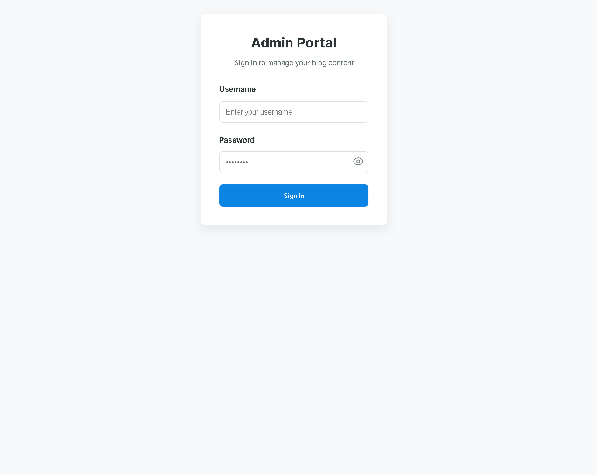
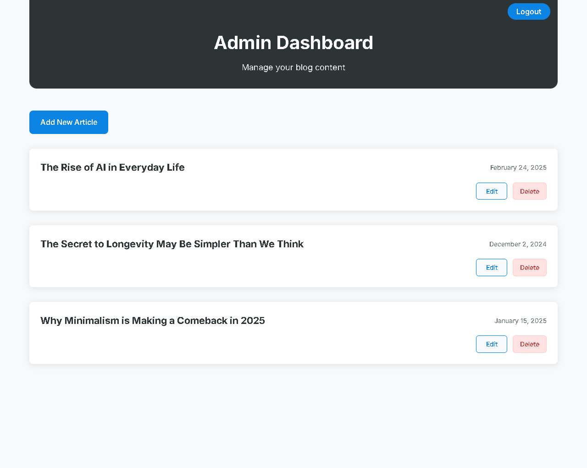
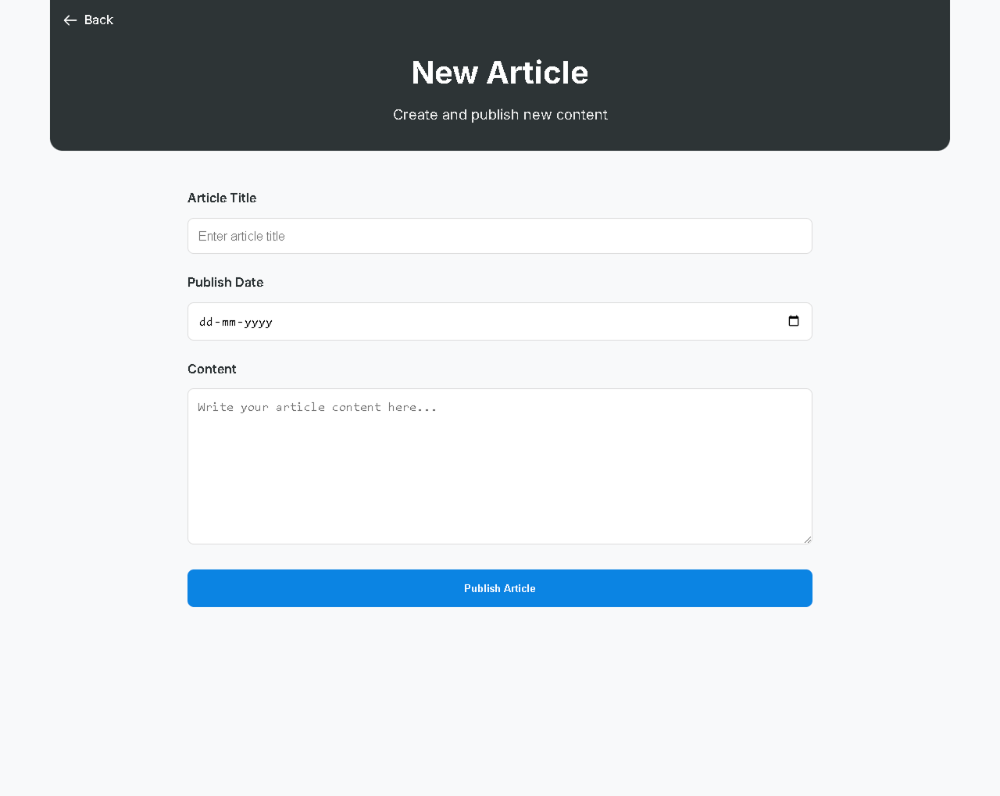
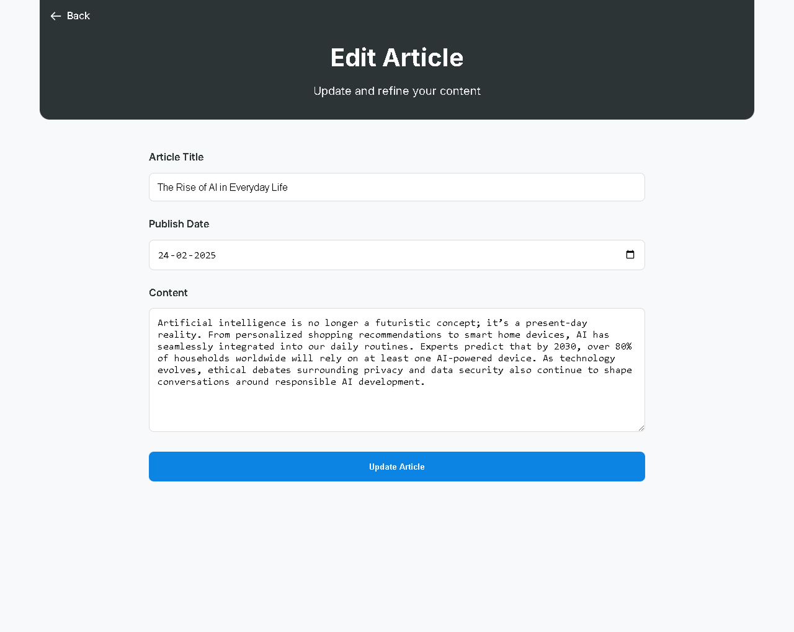
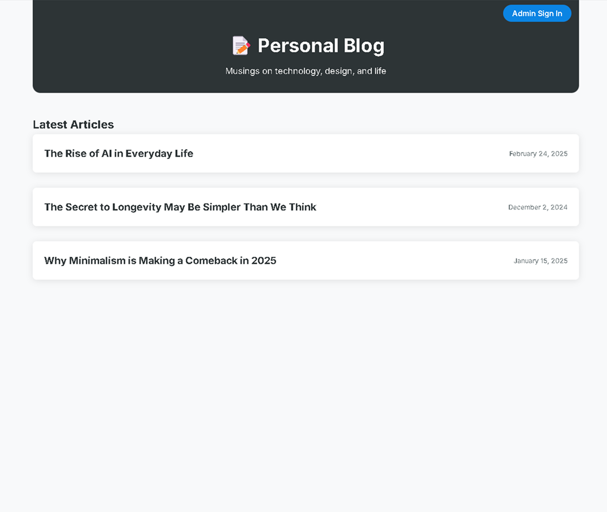
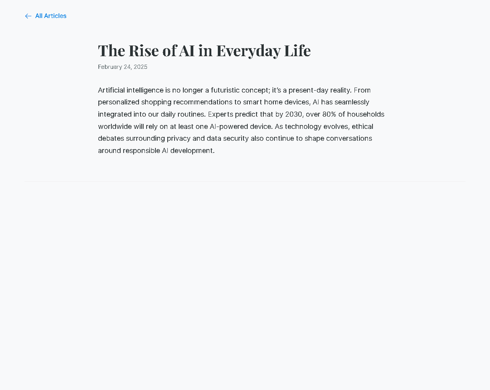

# 📝 **Personal Blog WebApp**

## **Project Overview**

This is a **Personal Blog Web Application** built using **Node.js, Express, and EJS**. It allows an admin to **create, edit, and delete blog articles**, while guests can **view published articles**. Articles are stored as **JSON files** for simplicity.

---

## 📂 **Project Structure**

```
personal-blog/
├── articles/             # JSON files storing each article
├── public/                # Static files (CSS, images, screenshots, etc.)
│   ├── css/
│   └── screenshots/
├── routes/                 # Route files (home, guest, admin, auth)
├── views/                   # EJS templates
├── app.js                   # Main application file
├── middleware/              # Auth middleware
└── README.md                 # This file
```

---

## 🚀 **How to Run the Application**

### Step 1: Install Dependencies

After cloning the repo, navigate into the project folder and run:

```bash
npm install
```

### Step 2: Start the Server

You can start the development server with:

```bash
npm run dev
```

The application will be available at:  
🔗 **http://localhost:3000**

---

## 🔑 **Admin Credentials**

| Username | Password      |
| -------- | ------------- |
| `admin`  | `password123` |

You can change these credentials in `routes/auth.js` if required.

---

## 📋 **Features**

✅ Guest users can:

- View all published articles on the home page.
- Read full articles with title, content, and publication date.

✅ Admin users can:

- Log in to the admin dashboard.
- Create new articles.
- Edit existing articles.
- Delete articles.

✅ Articles stored as JSON files in `/articles` directory.

---

## 📷 **Screenshots**

| Page                       | Screenshot                                                 |
| -------------------------- | ---------------------------------------------------------- |
| **Login Page**             |                      |
| **Admin Dashboard**        |  |
| **Add Article**            |          |
| **Edit Article**           |        |
| **Home Page (Guest View)** |                   |
| **Article Page**           |             |

---

## 🏃‍♂️ **Workflow**

1. Start app (`npm run dev`)
2. Visit `http://localhost:3000`
3. Admin logs in at `/login` with credentials
4. Manage articles from the dashboard
5. Guests can read articles without login

---

## ⚙️ **Technical Details**

- Backend: Node.js + Express
- View Engine: EJS
- CSS: Basic styling via `public/css`
- Authentication: Session-based (stored in memory)
- Storage: File-based (articles saved as JSON files)

---

## 📦 **Example Article JSON (in `/articles` folder)**

```json
{
  "title": "My First Blog Post",
  "date": "2025-02-25",
  "content": "This is the content of my first blog post."
}
```

---

## ❓ **Troubleshooting**

- If articles do not show up after creation, check if `/articles` folder exists and has write permissions.
- If login redirects back to the form, check session middleware configuration in `app.js`.

---

## 📄 **License**

This project is licensed under the MIT License.

---

## **Author** ✨

👨‍💻 Developed by **Mohammad Zeeshan Khan**  
📧 Contact: zeeshan2423@gmail.com

---
